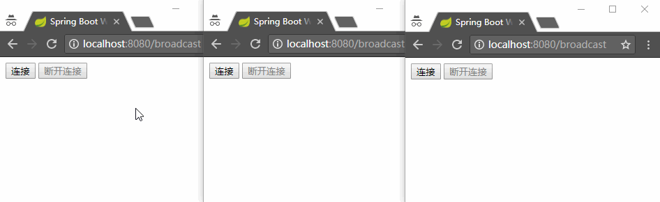
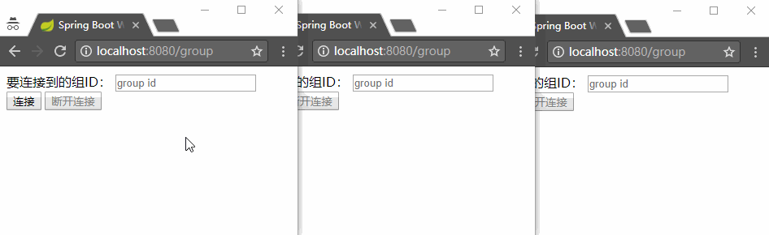
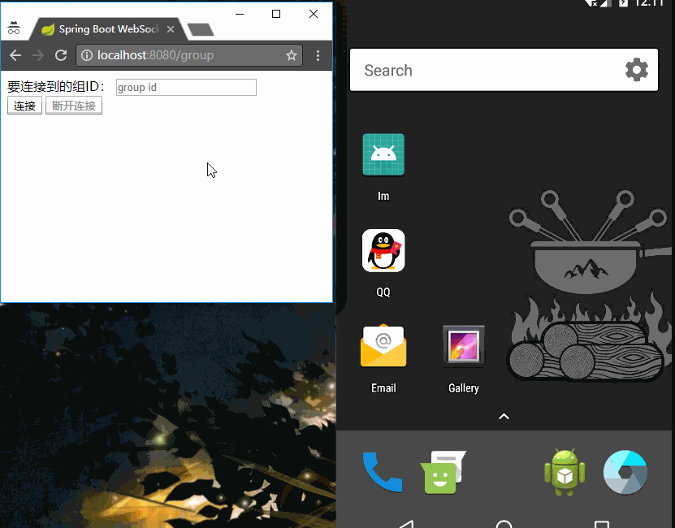
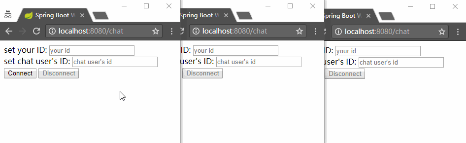
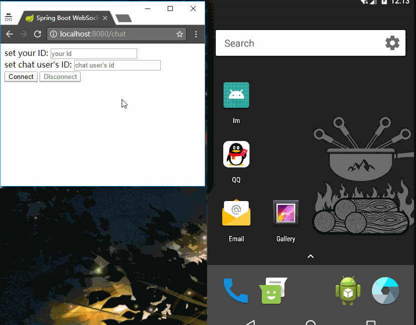

# Spring Boot WebSocket And Android Client

Spring Boot WebSocket Server, with a browser client and a simple Android client. Android client uses [StompProtocolAndroid](https://github.com/NaikSoftware/StompProtocolAndroid) which implements ptotocol [STOMP](https://en.wikipedia.org/wiki/Streaming_Text_Oriented_Messaging_Protocol) on Android, to subscribe or send message to server.

## Introduction

[中文](README_zh.md)

Server now include three endpoints to receive message from client:

1. `/broadcast`

This endpoint will simply transfer all messages it received to subscriber of `/b`.

2. `/group/{groupID}`

This endpoint is used to dynamicly create groups. For example, client can send a message to `/group/1`, and all subscriber of `/g/1` will receive the message. Also, you can change the subscribe endpoint by changing the [Controller](WebSocketServer/src/main/java/me/xlui/im/web/WebSocketController.java#L29) and [WebSocketConfig](WebSocketServer/src/main/java/me/xlui/im/config/WebSocketConfig.java#L26)

3. `/chat`

Endpoint `/chat` is used to enable point-to-point communication. If Alice(with userID 1) want to chat with Bob(with userID 2), she should send a message to endpoint `/chat` with a special json object defined as [ChatMessage](WebSocketServer/src/main/java/me/xlui/im/message/ChatMessage.java):

```js
// js code
function sendMessage() {
    var message = $('#message').val();
    stompClient.send('/chat', {}, JSON.stringify({
        'userID': 2, 
        'fromUserID': 1, 
        'message': "Hello Bob"})
    );
}
```

`userID` is necessary, this field will be used in server code to transfer message:

```java
simpMessagingTemplate.convertAndSendToUser(String.valueOf(chatMessage.getUserID()), "/msg", response);
```

Through code above, the message from Alice will be sent to `/user/2/msg`, and if Bob subscribe it(also means subscribe himself), he will receive the message.

And Alice should also subscribe herself to receive message sent to her:

```js
stompClient.subscribe('/user/' + 1 + '/msg', function (response) {
    showResponse(JSON.parse(response.body).responseMessage);
});
```

So when Bob send a message to Alice, she will receive it correctly.

## Token-Authorization

Sometimes, we want our endpoint can only be accessed by authorized users. So we need check users' identify.

And I have add an example of passing `token` through HTTP headers.

For server, we need to receive the header in our endpoint controller method:

```java
private String token = "this is a token generated by your code!";

@MessageMapping("/broadcast")
@SendTo("/b")
public Response say(Message message, @Header(value = "authorization") String authorizationToken) {
    if (authorizationToken.equals(token)) {
        System.out.println("Token check success!!!");
    } else {
        System.out.println("Token check failed!!!");
    }
    return new Response("Welcome, " + message.getName() + "!");
}
```

When you send a HTTP header `authorization` with a STOMP `SEND` method, the authorization token will be received properly.

For browser client, what we should do is add HTTP header in out `SEND` method:

```js
stompClient.send(
    '/broadcast',
    {
        "authorization": "this is a token generated by your code!"
    },
    JSON.stringify({'name': name})
);
```

So when we send a message to endpoint `/broadcast`, the header `authorization` will be sent as well. And the server will do some check to the `authorizationToken`.

For android client, it is similar to the browser client:

```java
String token = "this is a token generated by your code!";
StompHeader authorizationHeader = new StompHeader("authorization", token);
stompClient.send(new StompMessage(
        // Stomp command
        StompCommand.SEND,
        // Stomp Headers, Send Headers with STOMP
        // the first header is necessary, and the other can be customized by ourselves
        Arrays.asList(new StompHeader(StompHeader.DESTINATION, Const.broadcast), authorizationHeader),
        // Stomp payload
        jsonObject.toString())
    ).subscribe(...);
```

So, now we can generate token in server and send the token to users after the successful login. When user want to send message to endpoints we provide, a valid token is required!

## Server


## Broadcast(Browser)



## Broadcast(Android)


## Dynamic Groups(Browser)



## Dynamic Groups(Android)



## Point-to-Point Chat(Browser)



## Point-to-Point Chat(Android)



## LICENSE

[MIT](LICENSE)
