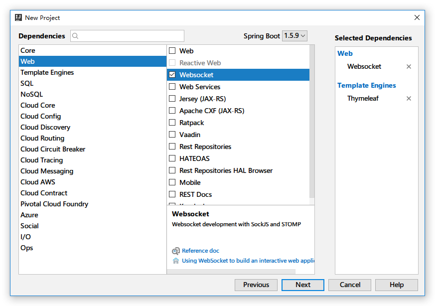
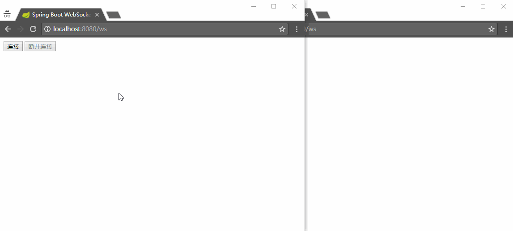
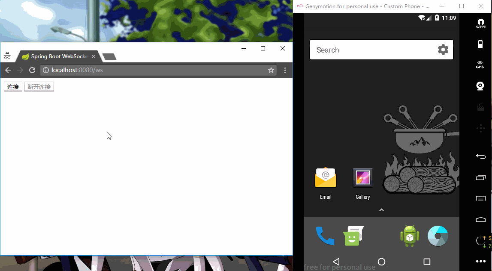
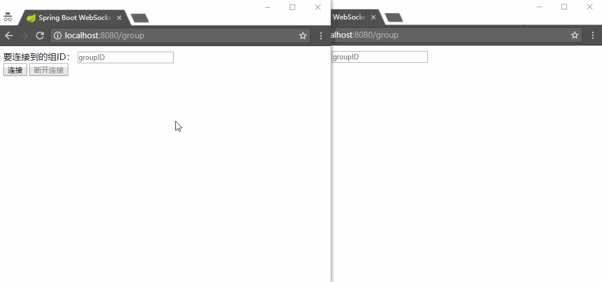
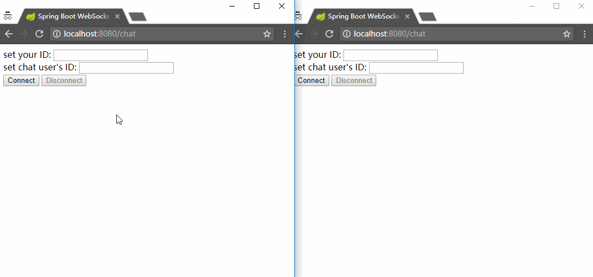

# Spring Boot WebSocket And Android Client

Spring Boot WebSocket Server, with a browser client and a simple Android client. Android client uses [StompProtocolAndroid](https://github.com/NaikSoftware/StompProtocolAndroid) which implements ptotocol [STOMP](https://en.wikipedia.org/wiki/Streaming_Text_Oriented_Messaging_Protocol) on Android, to subscribe or send message to server.

## Introduction

[中文](README_zh.md)

Server now include three endpoints to receive message from client:

1. `/broadcast`

This endpoint will simply transfer all messages it received to subscriber of `/b`.

2. `/group/{groupID}`

This endpoint is used to dynamicly create groups. For example, client can send a message to `/group/1`, and all subscriber of `/g/1` will receive the message. Also, you can change the subscribe endpoint by changing the [Controller](WebSocketServer/src/main/java/me/xlui/im/web/WebSocketController.java#L29) and [WebSocketConfig](WebSocketServer/src/main/java/me/xlui/im/config/WebSocketConfig.java#L24)

3. `/chat`

Endpoint `/chat` is used to enable point-to-point communication. If Alice(with userID 1) want to chat with Bob(with userID 2), she should send a message to endpoint `/chat` with a special json object defined as [ChatMessage](WebSocketServer/src/main/java/me/xlui/im/message/ChatMessage.java):

```js
// js code
function sendMessage() {
    var message = $('#message').val();
    stompClient.send('/chat', {}, JSON.stringify({
        'userID': 2, 
        'fromUserID': 1, 
        'message': "Hello Bob"})
    );
}
```

`userID` is necessary, this field will be used in server code to transfer message:

```java
simpMessagingTemplate.convertAndSendToUser(String.valueOf(chatMessage.getUserID()), "/msg", response);
```

Through code above, the message from Alice will be sent to `/user/2/msg`, and if Bob subscribe it(also means subscribe himself), he will receive the message.

And Alice should also subscribe herself to receive message sent to her:

```js
stompClient.subscribe('/user/' + 1 + '/msg', function (response) {
    showResponse(JSON.parse(response.body).responseMessage);
});
```

So when Bob send a message to Alice, she will receive it correctly.

<br/>

Android client and Browser support all endpoints now!

## Server



## Broadcast(Browser)



## Broadcast(Android)



## Dynamic Groups



## Point-to-Point Message



## LICENSE

MIT
